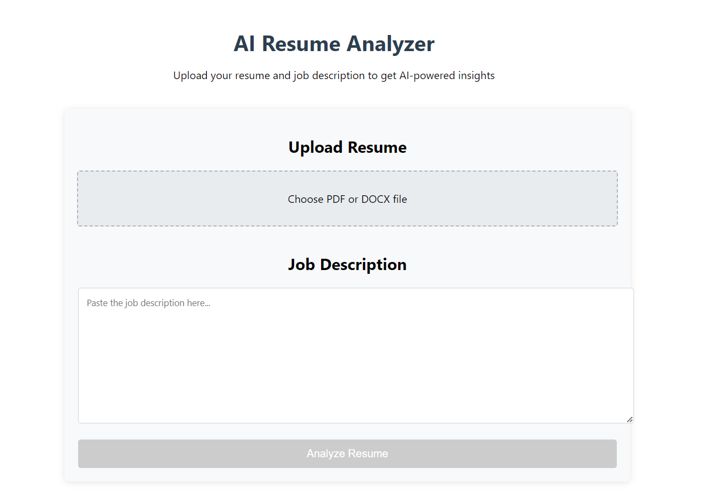
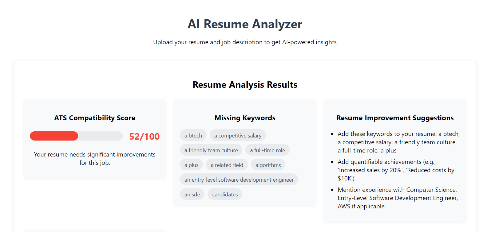
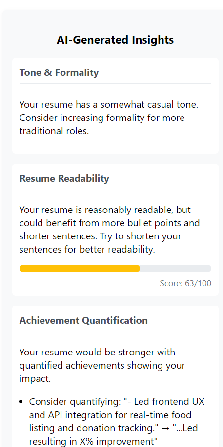
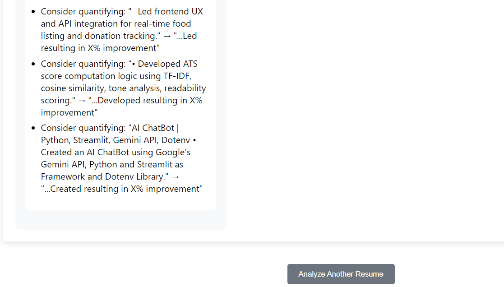

# AI Enhanced ATS System

A modern, AI-powered Applicant Tracking System (ATS) that streamlines the recruitment process by leveraging advanced algorithms for resume parsing, job matching, and insightful analytics.

## Features

- **Resume Upload & Parsing:** Upload resumes in various formats and extract structured candidate data automatically.
- **Job Description Analysis:** Input job descriptions and receive keyword extraction, skill matching, and suggestions for improvement.
- **AI-Powered Scoring:** Automatically score and rank candidates based on job fit using AI models.
- **Missing Keywords Detection:** Identify missing skills or keywords in resumes compared to job requirements.
- **Insights & Suggestions:** Get actionable insights and suggestions to improve both resumes and job descriptions.
- **Modern Frontend:** Intuitive and responsive React-based frontend for a seamless user experience.
- **RESTful Backend:** Robust backend (Python/Flask or Node.js) for handling API requests, file uploads, and AI processing.

## Project Structure

```
ats-backend/      # Backend code (API, AI logic, etc.)
ats-frontend/     # Frontend React app
```

## Getting Started

### Prerequisites

- Node.js & npm (for frontend)
- Python 3.x & pip (for backend)
- (Optional) Virtual environment for Python

### Backend Setup

```sh
cd ats-backend
python -m venv venv
venv\Scripts\activate  # On Windows
pip install -r requirements.txt
python app.py
```

### Frontend Setup

```sh
cd ats-frontend
npm install
npm start
```

### Usage

1. Start the backend server.
2. Start the frontend React app.
3. Open your browser and go to `http://localhost:3000`.

## Contributing

Pull requests are welcome! For major changes, please open an issue first to discuss what you would like to change.

## License

[MIT](LICENSE)

## Author

- [minallamohammedsohail](https://github.com/minallamohammedsohail)

## Screenshots

### Home Page


### Resume Analysis Results 1


### Resume Analysis Results 2


### Resume Analysis Results 3
 